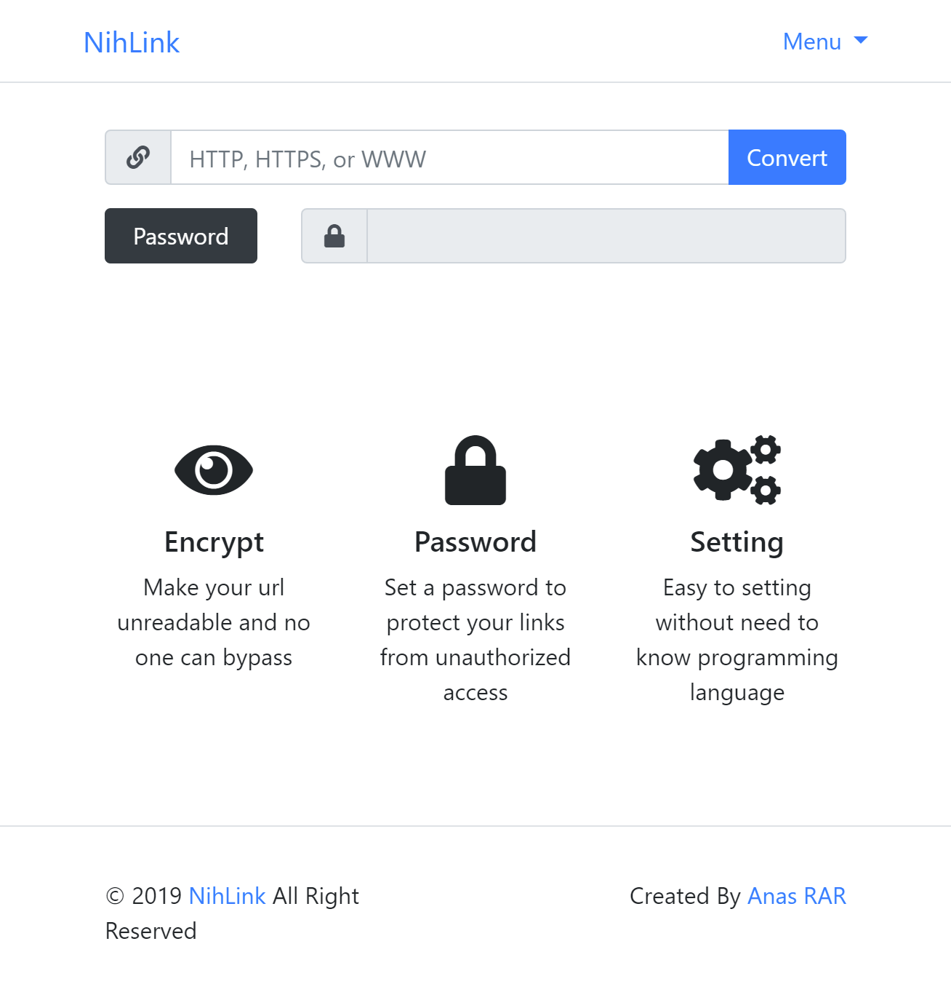

# NihLink Safelink Template Blogger

 

Simple Safelink Template Blogger

[ [DEMO](https://nihlink.blogspot.com) ]



# Feature

- Encrypt URL
- Unlock With Password
- Sticky Ads

# How To Make Safelink Page

On **HTML** Mode

Just insert ```<div id='output'></div>```

Or You Can Set The ID On Setting Section

## Example

```html
<p>Eum ab autem quia impedit facere. Molestias nemo facere quo. Tenetur ea occaecati. Iusto minus repudiandae qui et dolore. At aut enim dicta aut mollitia beatae. Ipsam qui quia qui ut vel error animi.</p>
<div id='output'></div>
<p>Eius cumque magnam nisi nulla itaque consequatur doloremque sit. Enim voluptas tempore harum aliquid explicabo ut adipisci corrupti. Dolorem aut optio ab porro dolores. Ipsa repellendus commodi. Dolorem voluptatem quasi dolorem voluptas dignissimos aut. Aut cumque voluptate atque excepturi unde est ea quis dolores.</p>
```

# Setting

Layout > page-setting > setting

## Value

```html
<script type="text/javascript">
  "use strict";
  $(document).ready(function() {
    window.new_config = {
      url: "", //blog url, if it is empty it will automatically use the blog url (don't add a slash at the end of the url)
      page: "p/page.html", // url safelink page / safelink article
      output: "#output", // place the output link, use the id attribute
      fixednavbar: true, // please change to true / false if you want the Navbar to float
      lang: {
        urlempty: "URL can not be empty",
        convertsuccess: "Convert URL success, copy url on box below",
        validtext: "HTTP, HTTPS, or WWW",
        gourltext: "Click here to go",
        nourl: "No URl here",
        errorconvert: "URL can not to convert",
        emptypass: "Password can not be empty",
        wrongpass: "Password is incorrect"
      }
    }
    window.config = $.extend({}, asli_config, new_config);
    });
</script>
```

# Built With

- [Bootstrap](https://getbootstrap.com/) 4.3.1
- [jQuery](https://jquery.com/) 2.1.4
- [Font Awesome](https://fontawesome.com/) 5.0.10
- [crypto-js](https://github.com/brix/crypto-js) 3.1.2